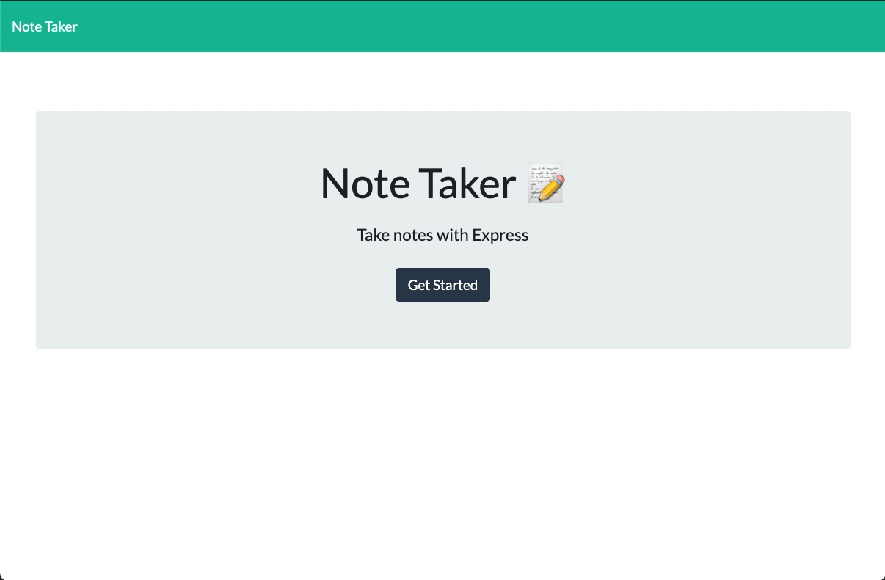

# Note Taker

# Desctiption
For this application, we created a database server using Express.js, which is a node package.

# Table of Contents
  * [Installation](#Installation)
  * [Usage](#Usage)
  * [License](#License)
  * [Screen Recording](#Screen-Recording)
  * [Questions](#Questions)

# Installation
This project was created using 'node.js' Make sure to have node.js installed before moving forward.

To learn how to install Node, [Click Here](https://nodejs.org/en/download/package-manager/).


Next you will need to install the necessary packages in the package.json file. To do so, enter the following:

```bash
npm i install
```

You should now have access to 'express.js' and 'uuid'. These packages are vital to run the application.

# Usage

To run the application locally. Type in the following in your terminal/bash:

```bash
npm start
```

If everything was successful, you should see this in your terminal

```bash
App listening on PORT 8000
```

The last step should be to go to your internet browswer (Chrome is preffered) and type into the address bar

```bash
http://localhost:8000
```

# License

[](https://kuyajasper.mit-license.org)


# Screen Recording




[Click Here To Launch Application](https://notetakerkuyajasper.herokuapp.com/)

# Questions

Reach out at:

[](https://github.com/KuyaJasper)

[](mailto:abarquezj1@gmail.com)

